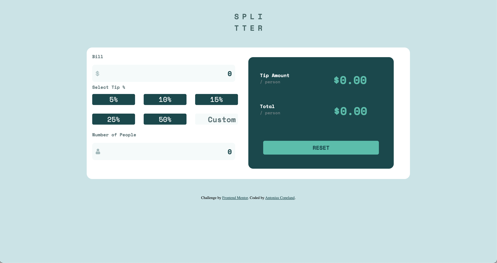

# Frontend Mentor - Tip calculator app solution

This is a solution to the [Tip calculator app challenge on Frontend Mentor](https://www.frontendmentor.io/challenges/tip-calculator-app-ugJNGbJUX). Frontend Mentor challenges help you improve your coding skills by building realistic projects.

## Table of contents

- [Overview](#overview)
  - [The challenge](#the-challenge)
  - [Screenshot](#screenshot)
- [My process](#my-process)
  - [Built with](#built-with)
  - [Continued development](#continued-development)
- [Author](#author)
- [Acknowledgments](#acknowledgments)

**Note: Delete this note and update the table of contents based on what sections you keep.**

## Overview

### The challenge

Users should be able to:

- View the optimal layout for the app depending on their device's screen size
- See hover states for all interactive elements on the page
- Calculate the correct tip and total cost of the bill per person

### Screenshot

### Links

- Solution URL: [FrontEnd Mentor](https://www.frontendmentor.io/solutions/tip-calculator-using-html-css-javascript-XAOu1TAvV)
- Live Site URL: [Tip Calculator Site](https://letyoursoulglo.github.io/Tip-Calculator-App/)

## My process

### Built with

- Semantic HTML5 markup
- CSS custom properties
- Flexbox
- Javascript
- Mobile-first workflow

### Continued development

With this project completed, I will continue to work on projects that will help me further develop my Javascript skills.

## Author

- Frontend Mentor - [@letyoursoulglo](https://www.frontendmentor.io/profile/letyoursoulglo)
- Twitter - [@YoungGifted_Blk](https://twitter.com/YoungGifted_Blk)
